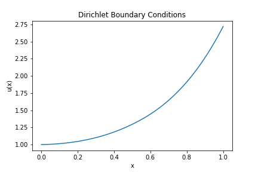
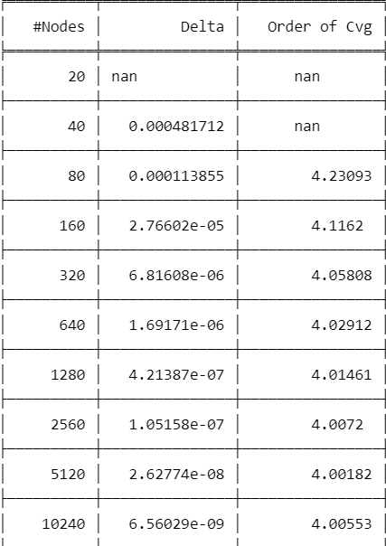
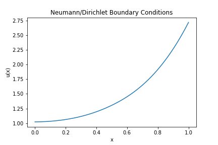
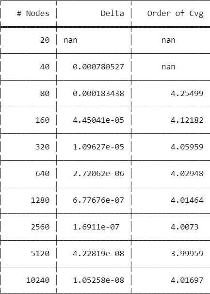
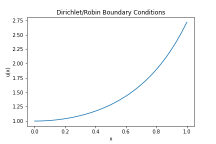
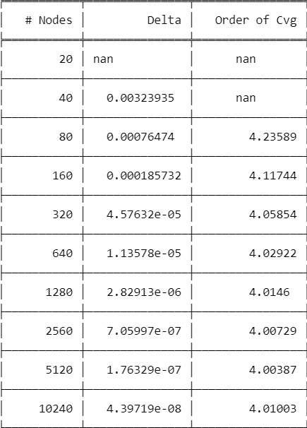

<h3 align="center">Advanced Numerical Analysis HW 2</h3>

  <p align="center">
    Code for solving a boundary value problem with the following choices of combinations for boundary conditions: Dirichlet on both boundary points, Dirichlet on one boundary and Neumann on the other, or Dirichlet on one boundary and Robin on the other
  </p>
</div>

<!-- GETTING STARTED -->
## Getting Started

The code requires Python to be installed on the machine.

### Prerequisites

The modules required in Python are
* tabulate
  ```sh
  pip install tabulate
  ```
* numpy
  ```sh
  pip install numpy
  ```
* scipy
  ```sh
  pip install scipy
  ```
* matplotlib
  ```sh
  pip install matplotlib
  ```

### Installation

1. Simply download HW2.py or HW2nb.pynb and run in your favorite Python environment
2. Install required modules

## Examples
The differential equation involved is given by $-u'' + c(x)u' + k(x)u = f$, 
where $c(x) = e^{-x^2}$, $k(x) = 2(2x^2+1)$, and $f(x) = 2x$.

#### Dirichlet Conditions on both boundary points:
$u(0) = 1$ and $u(1) = e$

<a href="https://github.com/Shlorki/NumericalHW2">
  
  
</a>

#### Dirichlet and Neumann Conditions:
$u'(0) = 0$ and $u(1)=e$

<a href="https://github.com/Shlorki/NumericalHW2">
  
  
</a>

#### Dirichlet and Robin Conditions:
$u(0)=1$ and $u'(1)=4e$

<a href="https://github.com/Shlorki/NumericalHW2">
  
  
</a>

<p align="right">(<a href="#readme-top">back to top</a>)</p>
